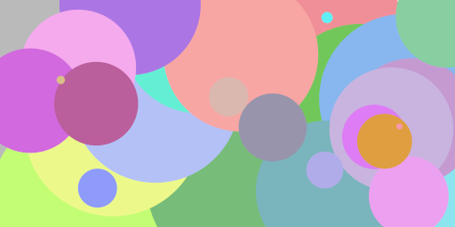
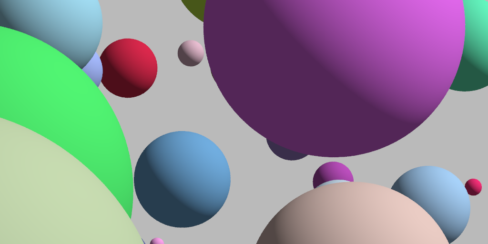
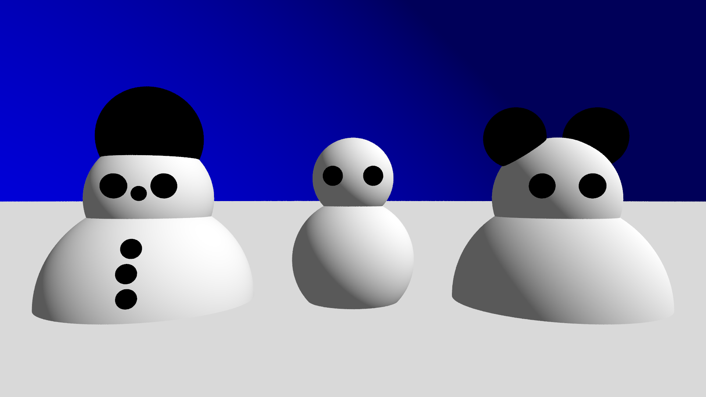
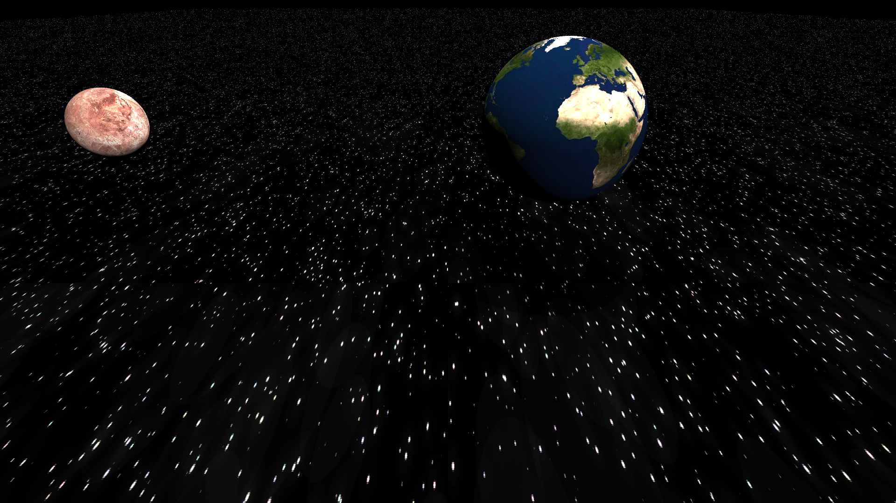
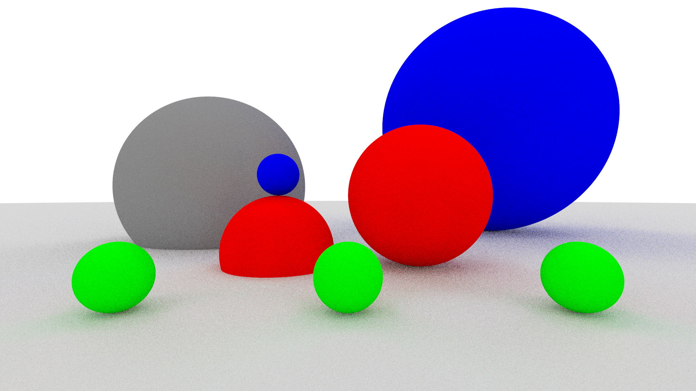

# Computergrafik Grundlagen

Diese Projekte haben wir in unserem Hochschul-Modul 'Computergrafik-Grundlagen' erstellt. Ziel des Projekts war es, sich mit den 
grundlegenden Konzepten und Techniken der Computergrafik auseinanderzusetzen. Die Klassen bauen jeweils aufeinander auf und erweitern sich im Laufe der Aufgaben. 
Die Themen sind jeweils in Unterordner unterteilt:

1. **Bilderzeugung**
    In dieser Aufgabe haben wir uns mit der Speicherung von Bildern und der Verhinderung von Alias-Effekten beschäftigt. Die ersten Bilder, die wir erstellt haben, bestand aus einfachen farbigen 2D Discs.

    

2. **Beginn unseres Raytracing-Implementierung**
    Ziel war es eine minimale Implementierung des Raytracing-Algorithmus. Zunächst werden Strahlen erzeugt, die dann mit einer Kugel geschnitten werden.

    

3. **Szene mit Shapes, Hintergrund, Ebene**
    Hier führten wir einige Code-Refactoring-Maßnahmen durch, um den Raytracer „skalierbar“ zu machen für komplexere hierarchische Szenen, die aus verschiedenen Objekttypen bestehen. Dabei werden auch der Hintergrund und Ebenen im Raum als solche Objekttypen hinzugefügt.

    

4. **Direkte Beleuchtung und Schatten**
    In dieser Aufgabe führten wir die Interfaces "Material" und "DirectLight" ein und erweitern den Raytracer um direkte Beleuchtung mittels des Phong-Modells, Lichtquellen und Schattenberechnung.

    

5. **Transformationen**
    Die Aufgabe bestand darin, die Transformationsmatritzen in die Kamera-Klasse und in die "Gruppenknoten" zu intergrieren. Dann übten wir den Umgang mit Transformationen an praktischen Aufgaben. Am Ende war das Ziel ein gelenkiges Wesen zu erstellen.

    

6. **Texturen**
    Hier integrierten wir prozedurale Texturen und Bildtexturen samt Texturtransformationen in einfache Shapes.

    

7. **Rekursiver Path Tracer**
    Wir erweiterten den Raytracer um ein rekursives Monte Carlo Path Tracing, um globale Beleuchtungseffekte darstellen zu können.

    

8. **Beschleunigung**
    In der letzten Aufgabe führten wir eine Hüllkörper-Hierarchie ein, um die Berechnungszeit für das Rendern von Szenen mit 1000 Shapes auf c.a. 17 Sekunden zu reduzieren.

    

## Technologien
    - Java Version 21
    - Maven zur Verwaltung von Abhängigkeiten